# punchtape ARCHITECTURE

punchtape is an **external transactional state machine** (shorter — the
external state machine, shorter still — the state machine; in running
text — the machine). The full design of the
machine in plain human language: from the reason it exists to every
feature, format, and integrity rule. The document is self-supporting —
it reads without the rest of the repository's documents. **Freshness
rule:** every change to the system — code, canon texts,
thresholds, surfaces, formats, directory layout — updates this document
in the same step; a divergence between this document and the code or
canon is a defect of that step. Terminology is in docs/GLOSSARY.md; the
feature registry and field coverage are in
docs/SCENARIOS.md (section 3).

## Contents

1. [Reason for existing](#1-reason-for-existing)
2. [Overall concept](#2-overall-concept)
3. [Components and flows](#3-components-and-flows)
4. [Task lifecycle](#4-task-lifecycle)
5. [Code packages](#5-code-packages)
6. [Features — the full registry and how each one works](#6-features--the-full-registry-and-how-each-one-works)
7. [Data formats](#7-data-formats)
8. [Integrity rules](#8-integrity-rules)

## 1. Reason for existing

A person speaks about the desired product in living language: "I want
the program to measure the fields itself and say how much to cut off."
Vibe coding takes such a wish and prints code — fast, but without
guarantees: behavior is unverified, edits break what sits next to them,
product knowledge lives in the session's head and dies with it.

punchtape is a deterministic core that stands between the person's wish
and the executor (an LLM agent) and turns the wish into code
with machine guarantees:

- **knowledge lives as data**, not in session memory: the wish, the
  spec, checks, code, the journal, meters — instance files that outlive
  everything;
- **readiness is measured by runs**, not by opinion: every usage
  scenario is run by the machine twice under clean conditions, the
  probe catches empty checks, the verdict is the machine's;
- **the human approves meaning, not bytes**: questions and held edits
  reach the human in living words, silence applies the recommended
  defaults, only the human decides the irreversible;
- **economics beats vibe coding**: tokens, human time, and attention
  are spent only on work, the machine's ceremonies are measured and
  kept within the cost gate's budget.

The measure of everything is a real user in the real world: less work
for the human, a cheaper result, clearer knowledge.

Example. The wish "notes: add and show" is turned by the machine into a
requirement, the scenario "empty storage — empty list", and a check;
the executor writes code; the machine runs the check twice in clean
directories, probes it with a broken surface, reconciles the trace —
and the READY verdict means: every row of the spec is proven by a
green run.

### The anti-entropy effect

Uncertainty of meaning is the same entropy: without work it grows.
The machine is a heat pump against it, and the effect is measurable:

1. **Locally, entropy can only be lowered by work** dissipated as
   heat: the machine pumps uncertainty out of the delivery loop and
   dissipates what was paid for into watts (tokens, double runs,
   containers). The second law is not broken — the entropy is moved.
2. **The bill is not for erasure** (Landauer: erasing a bit ≥
   kT·ln2 ≈ 3·10⁻²¹ J — all the informational entropy of a task is
   ~10⁻¹⁵ J against ~10⁵ J of real computing): the heat pays for
   SEARCH and MEASUREMENT. Cheap measurable heat buys expensive
   unmeasurable uncertainty — a "guarantee paid for in watts".
3. **Part of the entropy is not erased but relocated**: irreducible
   ambiguities of briefs are pumped out of the code into an explicit,
   auditable form — question → default → decision log; the entropy
   lies signed where it cannot go off.
4. **Order is stockpiled**: canon + a green verdict are a battery of
   order; regression re-runs are paid for in advance, edits are free
   in the sense of checking. The first delivery is expensive (pumping
   out), the following ones nearly free (battery discharge).
5. **Measured confirmation**: the judges of the three-hand run — 383
   red rows = freedom of interpretation per one input; the canon
   squeezed it down: 50/50 machine verdicts against 22% strict byte
   convergence for solo.

The same effect in three senses: **physical** — the pump, Landauer,
the battery of order; **cybernetic** — a closed loop and inversion of
ownership (the agent is a peripheral of the external state machine;
vibe coding is an open loop: write it and pray); **psychological** —
an immovable support: the human writes the wish and does not twitch,
the verdict is signed with a digest — trust without faith.

## 2. Overall concept

**An external transactional state machine.** The machine stands
OUTSIDE the agent's application and owns the task's state for good:
canon, transaction journal, digests, replay. An inversion of the
familiar picture: with state-machine libraries (inside the agent's
application) the application owns the state and loses it with the
session; here the agent is a peripheral, it does not touch state
directly, it only proposes transactions. "External" = "owner".
Transactionality: every submission is either accepted whole (gates
run, effects written to the journal, canon updated) or rejected with
a one-line reason and no state change; state is always derivable from
the journal, a crash is completed by re-applying the effects.

**The spec is data.** The wish is fixed by the `intent` delta; then
the executor authors the checks table (seed → commands →
expectations), and the machine compiles it into the canon itself:
requirements, scenarios, checks, trace. No second memory: everything
is a computable view of one canon.

**Total and clean agnosticism about everything.** The machine knows
and assumes NOTHING external: nothing about the project, product,
stack, language, structure, tools, delivery form, nor about the
execution environment — processes, daemons, "readiness", protocols,
ports, dictionaries of environment operations. The universal
observables are only argv, stdout, stderr, exit code, files;
operations on the world are running commands (arbitrary argv,
including a shell) and moving bytes (surface, seed, materials).
Everything specific is instance data and decisions of the
operator/executor. Any mechanic that prescribes the product's form,
the environment, or the executor's way of working is a defect.

**Black box.** Checks exercise behavior only through the "surface of
use" — what the operator declared as the build recipe (an artifact: a
file or tree), or, without a recipe, files by command names. The
machine does not climb inside the implementation: what cannot be
observed from outside is not its level.

**Determinism.** Same input — same output: canonical YAML rendering,
SHA-256 digests, a double run of every check with mandatory
byte-for-byte agreement (transience), newline normalization.

**The human approves meaning.** Everything addressed to the human
(questions, escalations, holds, specs) is in the wish's language, in
living words. The technical part (return codes, protocol, machine
terms) the machine formulates itself. A change to proven expectations
is held for human approval; nobody types bytes by hand — the machine
measures them with a run.

**Zero garbage.** In the working directory live: the product, the
AGENTS.md self-doc, and the hidden instance data `.punchtape`. Not a
single file appears from the executor except the submission. All
human-readable renders (per-feature specs, the registry, the summary,
the change log) are inside `.punchtape`; the machine writes them.

**Economics is a system property.** Slots are compact (a contextual
diff), repeated answers are anchored by digests, the background
rehearsal runs the suite in parallel with the hand, every meter (wall
time, calls, tokens) is in the ledger, ceremony overhead is in the
cost gate's budget.

## 3. Components and flows

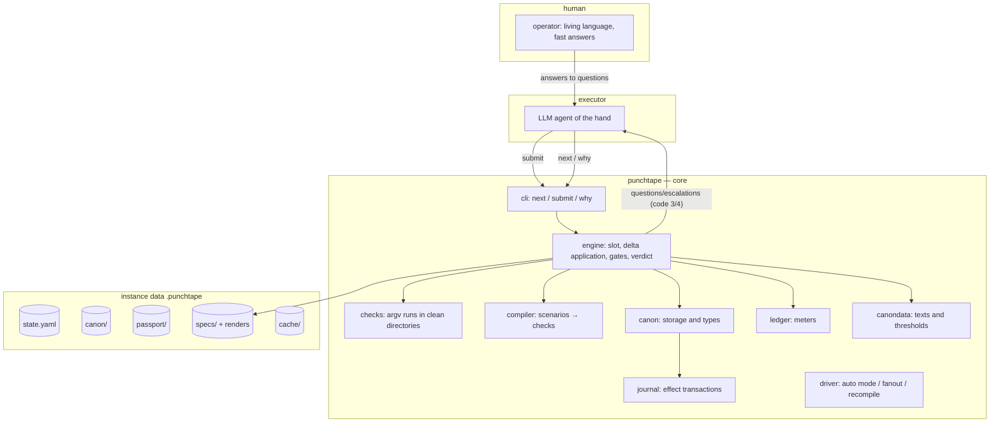

The working loop is the same always:

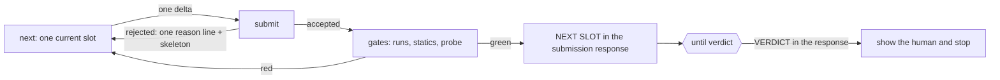

Data flow of one submission:

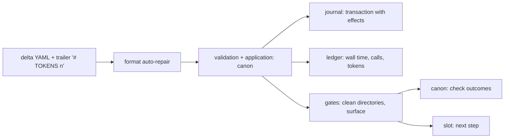

## 4. Task lifecycle

A task = one instance in its own directory. The process is a finite
state machine `wish-to-verdict`: stages and transitions are delivery
data (`canondata/data/scenarios.yaml`); the one exception — the
deliver→ac-compile return on new rows/spec after the verdict — lives
in code (apply.go, checktable.go).

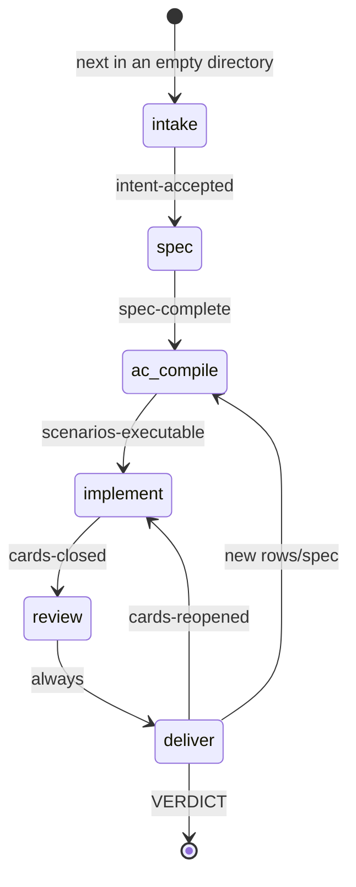

- **intake** — fixing the wish (`kind: intent`); the instance's
  language is determined by script share (≥ 30% Han — Chinese,
  ≥ 30% Cyrillic — Russian; otherwise English).
  A bare `next` in an empty directory creates an instance and prints
  the self-documentation.
- **spec** — authoring the checks table; an open question batch
  (`open-questions`) or a draft under review (`draft-review`) hold
  the stage; the exit is: requirements exist, scenarios exist, a
  requirement without a scenario does not exist.
- **ac-compile** — compiling acceptance: not one skeleton left, all
  the wish's command families covered by executable scenarios (or
  honestly waived with a reason); entering implement creates the
  whole-product card.
- **implement** — code and repair by cards; an open held edit holds
  the stage; composition freezes with the first code submission.
- **review** — an unconditional pass.
- **deliver** — the verdict; a reopened card returns the cycle to
  implement; a spec on deliver rolls the cycle back to acceptance
  compilation (a change request on proven changes).

One step of the cycle is a "slot": the situation, exactly one action,
a ready example, the submission gates. The slot is cached
(`cache/next-key`/`next.txt`); a repeated read prints a contextual
diff — unchanged blocks are collapsed under an anchor with a digest
(the ACTION line never collapses), a full print is `next --full`
(or the first read of an instance); inside list blocks that changed
(context cards, rows of red lists) unchanged ELEMENTS are collapsed
under a per-item anchor with a count — a growing table does not
reprint its unchanged tail. The example is not printed again — one
reference line with a fresh submission key.

One agent per task carries it from start to verdict: a submission is
accepted — the response already carries the next slot (`NEXT SLOT:`),
a separate `next` is not needed. A refusal is one line of reason (+ a
canonical skeleton on a format error, + a hint when the fix is
unique). Return codes are the stopping contract: 0 ok; 1 rejected;
2 failure; 3 choice point (a question batch is open: hand it to the
human or stay silent — silence applies the defaults); 4 escalation
(an open conflict — only an explicit living choice).

## 5. Code packages

- **cmd/punchtape** — entry point: parsing the verb, handing off to
  cli.
- **internal/cli** — the verb surface: `next [--full] [phrase]`,
  `submit [--check|--try] <file|->`, `why <topic|ID>`, utility
  `version`, `bg-suite`, `driver`; mapping of return codes 0–4; the
  intent ambiguity menu.
- **internal/engine** — the heart (`engine.go` — engine startup):
  slots (`next.go`, `compactslot.go`),
  application of all delta kinds (`apply.go`, `checktable.go`,
  `knowledge.go`, `amend.go`, `waive.go`), gate runs
  (`verify.go`), verdict and freeze (`verdict.go`), passport
  (`passport.go`, `contour.go` — the freshness contour), coverage
  (`coverage.go`), derivatives (`derive.go`),
  background suite rehearsal (`bgsuite.go`), why surfaces (`why.go`,
  `diary.go`, `handoff.go`), knowledge renders (`specrender.go`,
  `featurerender.go`, `summaryrender.go`, `changelogrender.go`,
  `specregistry.go`, `agentsref.go` — the self-doc, `digestcache.go` —
  the digest cache), the transaction writer (`writer.go`),
  stage auto-advance (`advance.go`, `scenario.go`), environment
  diagnostics (`envdoctor.go`).
- **internal/driver** — auto mode: a sequential scheduler slot →
  external executor → delta (`driver.go`), executor routing
  (`routing.go`), parallel waves of cards (fanout), double
  compilation — the twin instance (`recompile.go`).
- **internal/canon** — entities and storage: canon types with strict
  decoding (`types.go`, `validation.go`), write zones (`zones.go`),
  the store (`store.go`), the boundary passport (`passport.go`).
- **internal/checks** — check execution: clean temporary directories,
  arbitrary per-row argv (resolver: run-directory file (seed,
  material, an earlier command's output) → surface entry (artifact by
  recipe | project file by command[0] name without a recipe) →
  otherwise PATH from the environment; a name without a surface entry
  is given no meaning by the machine — the environment executes it as
  is), seed and materials byte-for-byte, the double run
  (transience), the broken-surface probe (only entries that actually
  exist are substituted; the probe does not touch PATH names), cleanup
  of the row's process groups, file snapshots, assertion of
  observations, capture of the observable, the run lock.
- **internal/compiler** — the spec compiler: scenario degrees
  (executable/skeleton/prose), expanding a scenario into a check
  (`TST-<n>`), a synchronization plan for multiple checks.
- **internal/delta** — all delta kinds: structures, decoding,
  resolution by stages, canonical skeletons (`skeletons.go`),
  format auto-repair (`repair.go`), hints (`suggest.go`).
- **internal/intent** — a router of everyday phrases to verbs (data
  in `intents.yaml`); ambiguity is a menu, not the machine's
  decision.
- **internal/brief** — executor call envelopes (cli/ide/api) and
  parsing of the `# TOKENS` trailer; the slot is never translated,
  only the envelope. Envelopes are byte-frugal: exactly the trailer
  line and the envelope wrappers are cut, the YAML document's bytes
  (including the trailing newlines of block scalars) are untouched.
- **internal/journal** — the transaction journal: an append-only
  stream of YAML documents, put/delete effects, idempotency by key
  and content digest. The digest format — exactly 64 lowercase hex —
  is validated before any canon lookup: a violation is rejected with
  one line carrying the rule "copy from FILES WRITTEN verbatim".
- **internal/ledger** — the journal of machine facts: events, wall
  time, calls, tokens (null = "not measured"), p95.
- **internal/yamlio** — canonical YAML: strict decoding, a stable
  marshal, atomic writes, digests, EOL normalization, the `.yamll`
  format (a document stream), literal byte escapes
  (`\n`, `\t`, `\xNN`).
- **internal/canondata** — the delivery's canon data: `//go:embed` of
  all surface texts and thresholds; code holds only keys and the
  rendering mechanics; cross-registry invariants are checked by the
  loader.

## 6. Features — the full registry and how each one works

The registry is docs/SCENARIOS.md, section 3 (118 features; registry
row codes in brackets). Here is the design of each feature with a
diagram. Groups as in the registry.

### Verbs (5)

**next (v-next)** — one current slot: stage, state, exactly one
action (ACTION), a ready delta example (EXAMPLE), a context slice
(CONTEXT), the submission gates (GATES ON SUBMIT); from the first
implement slot, when surfaces cannot be resolved, the CONVENTIONS
NEEDED block is printed. `--full` is a full print; the first call
prints the agent reference in full. A phrase after next goes to the
intent router.

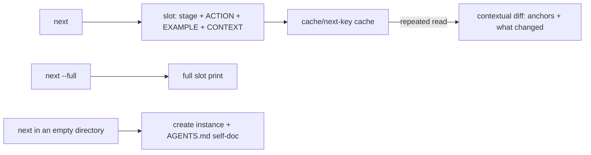

**submit (v-submit)** — submitting a delta from a file or stdin;
`--check` is preflight validation without application; `--try` is a
dry try of one table row (same runner, double run, a green/red
answer; canon and counters untouched); the response of an accepted
code/fix submission carries the FILES WRITTEN block and the next
slot; idempotency: the same content under any key is IDEMPOTENT
REPLAY without re-application.

```mermaid
flowchart TB
    F[file | stdin] --> V[auto-repair + validation]
    V -->|format error| R[refusal: one line + skeleton]
    V -->|duplicate by key/digest| RP[IDEMPOTENT REPLAY]
    V --> OK[apply: journal → effects → canon]
    OK --> G[submission gates]
    G --> N[NEXT SLOT in the response + FILES WRITTEN]
```

**why (v-why)** — an explanation of any topic and a card of any
entity: every number of the machine has an origin; topics are
computable views of the canon and the ledger (see "why topics").

```mermaid
flowchart LR
    W[why topic | ID] --> M{topic or entity?}
    M -->|topic| V[computable view: canon/ledger/passport]
    M -->|ID| K[card: canonical marshal of the entity]
```

**bg-suite (v-bg)** — background rehearsal: after a code/fix
submission a separate detached process runs all checks against the
surface digest; the report lives in the cache under the digest; a
live run takes priority — the rehearsal yields and lets the current
check finish.

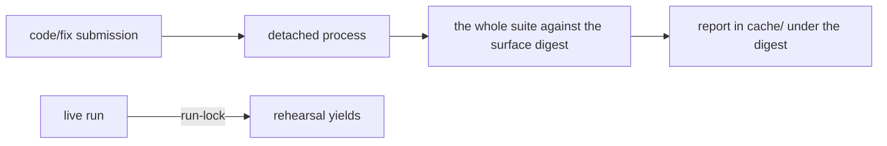

**driver (v-driver)** — auto mode: slot → external executor → delta;
fanout waves parallelize executors, application is sequential;
recompile is double compilation (gate below).

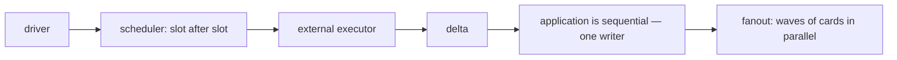

### why topics (27)

Every topic is a computable view; there is no second memory.

**price (w-price)** — the price of the current slot: bytes/tokens of
ACTION, EXAMPLE, CONTEXT, the full response, overhead, the ceiling.

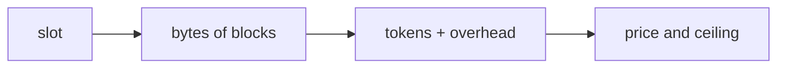

**stage (w-stage)** — the stage's meters from the ledger: deltas,
wall time, calls, tokens.

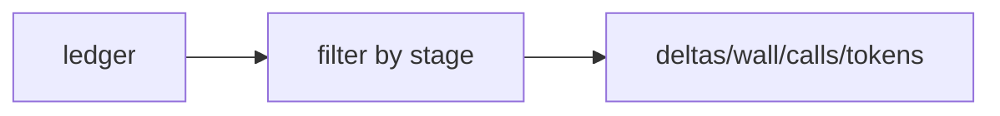

**derived (w-derived)** — a summary of the verdict's derivatives (at
deliver).

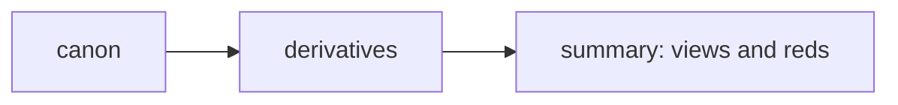

**red (w-red)** — the full list of red checks with reasons.

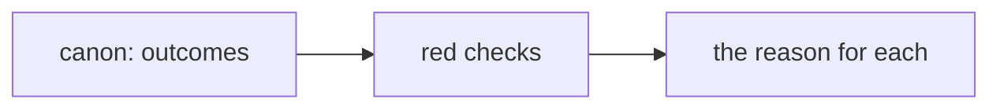

**latency (w-latency)** — p95 of verbs; the submit wall time minus
the time of honest runs.

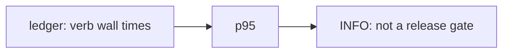

**passport (w-passport)** — the boundary passport: statuses along
the trust ladder, freshness (reconciliation of scope hashes and
conventions on the fly), inventory, backfill priority.

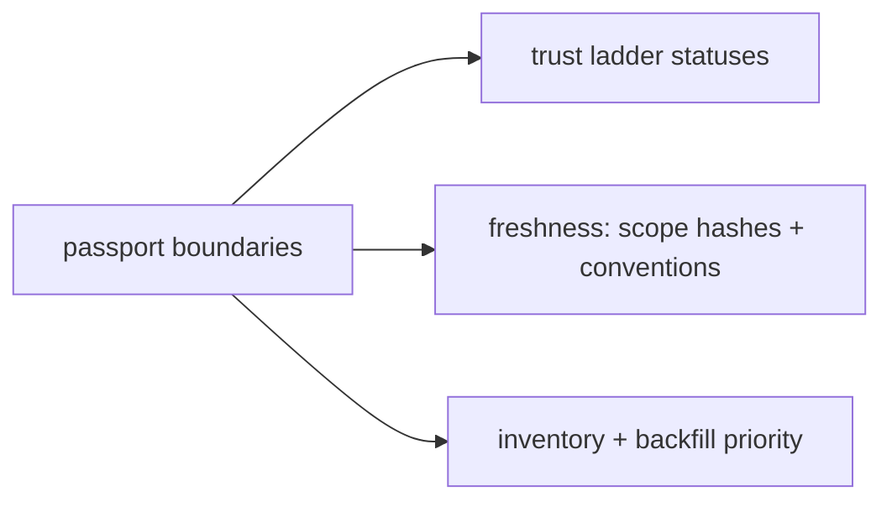

**diary (w-diary)** — a diary of machine-observed pains: counters,
diagnosis, workaround.

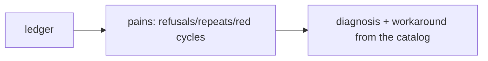

**impact (w-impact)** — a reverse index file → boundaries: what an
edit will touch.

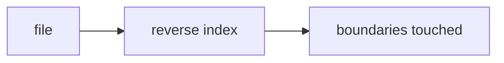

**knowledge (w-knowledge)** — the Decision Log, the forbidden zone,
the knowledge base.

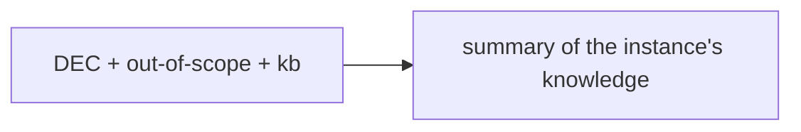

**verifications (w-verif)** — by whom/by whom/by what each boundary
was verified (by the machine, by an anchor transaction).

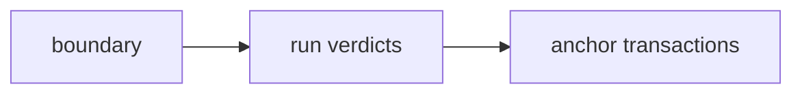

**amend (w-amend)** — the held edit verbatim with an application
plan.

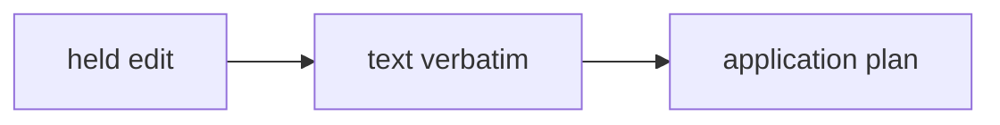

**drift (w-drift)** — drift of the instance against the acceptance
moment. A claim needs two signatures: the recorded acceptance digest
and a measurable current one, both sides computed through the same
check normalization; a moment where the surface is not measurable
(or an acceptance recorded without a signature) claims nothing —
the gap is named, not drifted.

```mermaid
flowchart LR
    A[acceptance signature] -.->|comparison| N[current signature]
    N -->|diverged| D[drift: verdict downgraded]
    N -.->|not measurable| H[named gap: no claim]
```

**acceptance (w-accept)** — the acceptance moment: outcome, digest,
bill, env.

```mermaid
flowchart LR
    G[all cards green/quarantine] --> R[ledger record]
    R --> D[digest of the surface + check definitions]
```

**surface (w-surface)** — the verification surface and its digest.

```mermaid
flowchart LR
    R[recipe | command files] --> S[surface] --> D[surface digest]
```

**coverage (w-coverage)** — command families without an executable
scenario + active waivers with reasons.

```mermaid
flowchart LR
    W[the wish's command families] --> C[executable scenarios]
    W -.->|without a scenario| G[gap: name each one]
    V[waivers] --> P[with reasons]
```

**spec (w-spec)** — the spec registry and search by all words; the
human render is `.punchtape/specs`.

```mermaid
flowchart LR
    Q[why spec words] --> R[registry: names/statuses/scenarios]
    Q --> T[spec texts]
```

**attention (w-attention)** — a summary of human attention:
questions, choices, defaults, the attention wall.

```mermaid
flowchart LR
    L[ledger: question → choice] --> S[attention summary + wall]
```

**retro (w-retro)** — a retrospective over the pain diary with a
call to record the cure.

```mermaid
flowchart LR
    D[pain diary] --> F[frequencies] --> H[workarounds]
    H --> C[call: record the cure in kb]
```

**handoff (w-handoff)** — a computable session handoff: facts + a
ready prompt.

```mermaid
flowchart LR
    I[instance: facts] --> H[handoff: facts + continuation prompt]
```

**hypotheses (w-hyp)** — a registry of hypotheses about changes to
the delivery canon.

```mermaid
flowchart LR
    H[change → hypothesis → metric] --> R[window/baseline/outcome]
```

**compatibility (w-compat)** — the compatibility matrix (only the
measured is recorded as measured, silence is forbidden).

```mermaid
flowchart LR
    M[measured environments] --> C[GOOS/GOARCH matrix]
    U[unmeasured] --> N[an honest 'not measured']
```

**freeze (w-freeze)** — freeze renders the same
canon text the slot prints (divergence is impossible by
construction).

```mermaid
flowchart LR
    K[canon] --> T[the same text] --> S[freeze slot]
```

**repair (w-repair)** — a slot concept: row-by-row repair of a red
row's expectations.

```mermaid
flowchart LR
    R[red row] --> P[repair exactly it] --> U[resubmit the row]
```

**regenerate (w-regen)** — the action the slot proposes on a deep
red (more than half the card's scenarios or a second attempt):
rewrite the facet from scratch instead of patching.

```mermaid
flowchart LR
    D[deep red >50% | 2nd attempt] --> G[rewrite the facet whole]
```

**rerun (w-rerun)** — a slot concept: a submission whose content has
entirely converged with the project is a pure re-run (see deltas).

```mermaid
flowchart LR
    S[code/fix without a new byte] --> R[RERUN: do not apply]
    R --> G[gates synchronously, counters stand still]
```

**fragment (w-frag)** — `why fragment SCN-<n>`: the scenario's
observations as a ready YAML block for match edits.

```mermaid
flowchart LR
    N[why fragment SCN-n] --> O[observations as a YAML block]
```

**entity cards (w-card)** — REQ-/SCN-/CRD-/IFC-/TST-/DEC-/KB- —
the canonical marshal in full; the kind word before the ID is
allowed.

```mermaid
flowchart LR
    I[why <ID>] --> C[canonical marshal of the whole entity]
```

### Stages and verdict (10)

Stages are process-as-data (scenarios.yaml); the runner visits each
at most once per pass, forks are decided by the human (the full life
diagram is section 4). One article per stage:

**intake (st-intake)** — fixing the wish (`kind: intent`); the
instance's language is determined by script share (≥ 30% Han —
Chinese, ≥ 30% Cyrillic — Russian; otherwise English); a bare `next`
in an empty directory creates an instance and prints the self-doc.

```mermaid
flowchart LR
    N[next in an empty directory] --> I[instance + self-doc]
    W[the wish] --> D[kind: intent] -->|accepted| S[st-spec]
```

**spec (st-spec)** — authoring the checks table; an open question
batch (`open-questions`) or a draft under review (`draft-review`)
hold the stage; the exit is: requirements exist, scenarios exist, a
requirement without a scenario does not exist.

```mermaid
flowchart LR
    T[checks table] -->|spec-complete| A[ac-compile]
    Q[open question batch | draft-review] -.->|hold| T
```

**ac-compile (st-ac)** — compiling acceptance: not one skeleton
left, all the wish's command families covered by executable
scenarios (or honestly waived with a reason); entering implement
creates the whole-product card.

```mermaid
flowchart LR
    C[family coverage + no skeletons] -->|scenarios-executable| I[implement + whole-product card]
    W[waive with a reason] -.->|an honest family refusal| C
```

**implement (st-impl)** — code and repair by cards; an open held
edit holds the stage; composition freezes with the first code
submission.

```mermaid
flowchart LR
    K[code/fix by cards] -->|cards-closed| R[review]
    H[an open held edit] -.->|holds| K
```

**review (st-rev)** — an unconditional pass.

```mermaid
flowchart LR
    R[review] -->|always| D[deliver]
```

**deliver (st-del)** — the verdict; a reopened card returns the
cycle to implement; a spec on deliver rolls the cycle back to
acceptance compilation (a change request on proven changes).

```mermaid
flowchart LR
    D[deliver] -->|cards-reopened| I[implement]
    D -->|new rows/spec| A[ac-compile]
    D -->|VERDICT| S[stop]
```

**Composition freeze (st-freeze)** — the first code submission fixes
the spec's composition: changing a proven row requires human
approval.

```mermaid
flowchart LR
    C[first code submission] --> F[spec composition frozen]
    F -->|change of a proven row| H[change request: human approval]
```

**Verdict + digest (st-verdict)** — READY / QUARANTINE /
NOT-READY: scenarios, trace, checks, derivatives, submissions/runs,
the bill, attention, convergence, acceptance, double-compile, cost,
gate retirement, latency (INFO), quarantine with a question to the
human, the taste queue (prose and waivers). The digest is over
normalized rows without live meters. The description of every
delivered feature is part of "done": an empty author's description
holds NOT-READY with a named action row (submit `kind: feature`);
an honest gap is accepted by the human waiving the `feature.doc`
rule with a reason.

```mermaid
flowchart TB
    G[gates green] --> P[feature prose authored?]
    P -->|no| NR[NOT-READY: a named action]
    P -->|yes| R[READY]
    B[attempts budget exhausted] --> Q[QUARANTINE: a question to the human]
    R --> D[digest over normalized rows]
```

**Acceptance moment (st-accept)** — all cards green/quarantine → a
ledger record with the digest of the surface and of all check
definitions; later drift downgrades the verdict.

```mermaid
flowchart LR
    A[all cards green/quarantine] --> L[ledger record]
    L --> D[digest of surface + definitions]
    D -.->|files gone| NG[no signature to compare: named, not drifted]
```

**Refreeze (st-refreeze)** — the journal head has changed (change
request, double-compile) → the verdict is rendered anew; the freeze
regenerates the knowledge renders in the same step.

```mermaid
flowchart LR
    H[journal head changed] --> V[verdict anew]
    V --> Z[freeze: regenerate knowledge renders]
```

### Deltas (16)

Kinds: **intent** (the wish), **lint** (executor questions:
reachability/unambiguity; a conflict — at any time), **clarify**
(answers), **checks** (the checks table — the main authoring path),
**spec** (composition operations: requirements/scenarios/
assertions), **assert** (pin assertions to a skeleton), **split**
(a cut into cards and contracts), **code** (the card's files: text or
a content digest from the journal), **fix** (repair against a red
gate, reply-to required), **probe** (formalizing observed calls — at
deliver, the spec catches up with the code), **conventions** (an
environment recipe: build with an `{out}`/`{name}` artifact, types,
lint), **amend** (human approval of a held edit), **waive** (waiving
a completeness rule with a reason), **decision** (Decision Log /
forbidden zone), **kb** (knowledge "when X do Y", with replacement of
outdated entries), **feature** (the prose of a feature's human spec +
ratification by the operator).

**intent (d-intent)** — the wish verbatim, in living language; sets
the instance's language and the task's origin.

```mermaid
flowchart LR
    W[the human's wish] --> D[kind: intent] --> K[canon: origin + language]
```

**lint (d-lint)** — executor questions about the wish's
reachability/unambiguity; a conflict of requirements — at any time.

```mermaid
flowchart LR
    E[executor question] --> D[kind: lint] --> B[a question batch for the human]
```

**clarify (d-clar)** — answers to a question batch; one answer closes
the whole batch.

```mermaid
flowchart LR
    B[question batch] --> A[human answer/default] --> D[kind: clarify]
    D --> L[echo of choices: CLARIFIED]
```

**checks (d-checks)** — the checks table, the main spec authoring
path.

```mermaid
flowchart LR
    T[rows: seed → run → expectations] --> D[kind: checks]
    D --> C[compilation: requirements/scenarios/checks/trace]
```

**spec (d-spec)** — composition operations: requirements, scenarios,
assertions (add/update/remove) with invariants.

```mermaid
flowchart LR
    O[composition operations] --> D[kind: spec] --> I[canon invariants]
```

**assert (d-assert)** — pin assertions to a scenario skeleton.

```mermaid
flowchart LR
    S[scenario skeleton] --> D[kind: assert] --> U[assertions pinned]
```

**split (d-split)** — cutting the product into facets of parallel
work: cards with exclusive ownership of files and contracts for
shared assets. Only before the first code; the cut proposal in the
slot is PROPOSED CUT (a big scope — BIG SCOPE — splits itself).

```mermaid
flowchart LR
    W[whole-product card] --> D[kind: split]
    D --> C[facet cards + IFC contracts for shared assets]
```

**code (d-code)** — the card's files as full text or a digest
reference from FILES WRITTEN.

```mermaid
flowchart LR
    F[files: text | digest reference] --> D[kind: code]
    D --> W[write + FILES WRITTEN: path → digest]
```

**fix (d-fix)** — repair against a red gate; reply-to required.

```mermaid
flowchart LR
    R[red gate] --> D[kind: fix, reply-to]
    D --> G[gates anew]
```

**probe (d-probe)** — formalizing observed calls into spec rows at
release: the spec catches up with code that has stabilized.

```mermaid
flowchart LR
    O[observed calls] --> D[kind: probe] --> R[spec rows from the facts]
```

**conventions (d-conv)** — an environment recipe: build commands
with an `{out}`/`{name}` artifact, optional types/lint.

```mermaid
flowchart LR
    R[recipe: build/types/lint] --> D[kind: conventions]
    D --> P[passport: conventions + static gates into service]
```

**amend (d-amend)** — human approval of a held edit
(approve/reject).

```mermaid
flowchart LR
    H[held edit] --> D[kind: amend]
    D -->|approve| A[apply]
    D -->|reject| K[drop]
```

**waive (d-waive)** — waiving a completeness rule with a reason; the
rule stops blocking but stays visible in the verdict.

```mermaid
flowchart LR
    R[rule: coverage.family | feature.doc] --> D[kind: waive + reason]
    D --> V[visible in the verdict, not blocking]
```

**decision (d-dec)** — Decision Log / forbidden zone: operator
decisions with justifications.

```mermaid
flowchart LR
    X[operator decision] --> D[kind: decision] --> L[DEC- | out-of-scope]
```

**kb (d-kb)** — knowledge "when X do Y" with a source and
replacement of outdated entries.

```mermaid
flowchart LR
    K[when X do Y] --> D[kind: kb] --> M[trigger match in context]
```

**feature (d-feature)** — the prose of a feature's human
spec: what it does, how it is called, what is visible, boundaries
and errors; new text waits for ratification anew (`ratify: true` —
the operator); an empty description holds the verdict at NOT-READY.

```mermaid
flowchart LR
    P[feature prose in living words] --> D[kind: feature]
    D -->|new text| R[ratification removed]
    D -->|ratify: true| O[the operator approved]
```

**Checks table — common rules** — a row = seed
(`seeds`/`materials`) + `run` (arbitrary argv: a surface input, a
utility, a shell; every command but the last must exit 0) +
expectations of the last (`out`/`err`/`rc`/`state`/`volatile`).
The same row (seed+materials+commands) with different expectations
is a replacement; repair is row-by-row. A row carrying an authorial
`key:` replaces its never-green prior versions under that key even
with different seeds and run — a broken row's repair does not orphan
the broken original; a key held by a proven row keeps the
change-request channel (no bypass). An addition whose form
(seed+commands) matched an existing row but whose materials did not
is not a replacement: the submission response names such twin rows
explicitly — there are no silent duplicates in the canon. Every
element of run is a whole command; a submission where all elements
of run are single words (the signature of a flattened argv —
`run: [tool, src, out]` instead of one element `tool src out`) gets
a response note.

```mermaid
flowchart LR
    R[row: seeds + materials + run] --> E[expectations of the last command]
    R --> ID[identity: same form → replace expectations]
    R -->|different materials| DB[twin: named explicitly]
```

**update-assertions** — surgical edits of one scenario's
assertions: match+set / match+drop / match+capture / add; match must
match exactly one current observation.

```mermaid
flowchart LR
    M[match: exactly one observation] --> S[set | drop | capture | add]
```

**Idempotency** — the submission key or content digest; a repeat
does not apply and does not move counters.

```mermaid
flowchart LR
    S[submission] --> Q{key/digest seen before?}
    Q -->|yes| I[IDEMPOTENT REPLAY]
    Q -->|no| A[apply]
```

**File digests and re-runs** — the response of an accepted code/fix
submission carries the FILES WRITTEN block: "path → canonical
digest" of every written file. The next submission is mixed: changed
files as full text, unchanged ones as a `digest:` reference from
that block (the machine computes digests; the hand does not invent
them). A submission whose content has entirely converged with the
project (not a single new byte) is a pure re-run: the response is
RERUN, nothing is applied, counters do not move, gates run
synchronously — an honest way to re-verify after an environment
recovery or a recipe change. Diffs/patches are rejected on
principle: the full text of the changed file is the only form.

```mermaid
flowchart LR
    F[FILES WRITTEN: path → digest] --> N[next submission: text | digest]
    N -->|not one new byte| R[RERUN: gates synchronous, no application]
```

### Spec and edits (8)

**Requirements CRUD (sp-req)** — add/update/remove of requirements
with invariants: a requirement without a scenario does not exist.

```mermaid
flowchart LR
    O[requirements CRUD] --> I[invariant: requirement ↔ scenario]
```

**Scenarios CRUD/rebind (sp-scn)** — add/update/remove of
scenarios; rebinding a scenario to a requirement is legal (rebind);
row contradictions (the same run — incompatible expectations,
including a single row contradicting itself) are caught at
acceptance; the verdict names the run's command and the observation —
canon identifiers are not visible to the hand.

```mermaid
flowchart LR
    O[scenarios CRUD] -->|rebind| R[rebinding is legal]
    S[the same run] --> P[incompatible expectations → verdict]
```

**update-assertions (sp-ua)** — surgical edits of one scenario's
assertions: match+set / match+drop / match+capture / add; match must
match exactly one current observation.

```mermaid
flowchart LR
    M[match: exactly one observation] --> S[set | drop | capture | add]
```

```mermaid
flowchart LR
    A[scenario assertions] --> M[match+set/drop/capture/add]
```

**detail block (sp-detail)** — a filled boundary block must be
complete: invariants, edge cases, the failure matrix, concurrency —
each covered by scenarios or an explicit "no" with a reason.

```mermaid
flowchart LR
    D[boundary detail] --> C[completeness: invariants/edges/failures/concurrency]
    C -->|a gap| N[an explicit 'no' with a reason]
```

**Dependencies (sp-dep)** — links between requirements: what follows
from what.

```mermaid
flowchart LR
    A[requirement A] -->|depends| B[requirement B]
```

**Prose scenarios (sp-prose)** — the unmeasurable remainder lives
as a prose scenario, is not compiled into a check, and is visible in
the verdict and the spec.

```mermaid
flowchart LR
    S[prose scenario] --> V[visible in the verdict/spec]
    S -.->|not compiled| C[check]
```

**A requirement without a scenario (sp-invariant)** — does not
exist: the canon invariant catches it at acceptance.

```mermaid
flowchart LR
    R[requirement] -->|no scenario| X[acceptance refusal]
```

**Row identity (sp-rowid)** — seed + materials + commands: matched
byte-for-byte — the same row.

```mermaid
flowchart LR
    K[seed + materials + run] --> ID[row identity]
    ID -->|matched| S[the same row: replace expectations]
```

### Checks (8)

**Double run suite (c-suite)** — every check in its own clean
temporary directory, twice; observations must match byte-for-byte;
declared volatility (`volatile`: stream names, state file paths) is
not reconciled, file presence is strictly always. The pair is
strictly serial with a hard barrier: the first run's process group
is dead — waited, not just signalled — before the second begins, so
what the first run held (a port, a lock) is released.

```mermaid
flowchart LR
    C[clean directory] --> R1[run 1] --> O1[observations]
    C --> R2[run 2] --> O2[observations]
    O1 --> E{byte-for-byte?}
    O2 --> E
    E -->|yes| G[green]
    E -->|no| R[red: transience]
```

**The coverage-probe (c-probe)** — a green check must go red on a
broken surface (a stub on an artifact entry that actually exists;
PATH names are not substituted — a row made only of PATH tools is
precisely one that checks nothing); if it did not go red, it checks
nothing (pin-red, repair is free).

```mermaid
flowchart LR
    G[green check] --> B[break the surface: a stub]
    B -->|went red| O[it checks]
    B -->|stayed green| P[pin-red: checks nothing]
```

**Trace (c-trace)** — every executable scenario is linked to a
check; the anchor is the scenario identifier inside the check
itself.

```mermaid
flowchart LR
    S[scenario] -->|SCN-ID in the check| T[check TST-n]
    T -.->|link lost| M[MISSING LINKS: gate red]
```

**Derivatives derive (c-derive)** — auto-extension of the suite from
every scenario: empty state, restart-repeat, zero/minus/neighbors of
numeric arguments, removing a seed key (budget 8); the invariant is
clean success or clean failure; they do not enter the canon, one row
into the verdict.

```mermaid
flowchart LR
    S[scenario] --> D[variants: empty/restart/zero/minus/neighbors/remove seed]
    D --> V[invariant: success or failure]
    D -.-> K[not into the canon: a verdict row]
```

**proven/free-repair (c-proven)** — a green run at least once
(`proven`); editing proven expectations requires human approval; a
pin-red row proves nothing; unproven rows are repaired freely.

```mermaid
flowchart LR
    R[row] -->|has been green| P[proven: an edit needs approval]
    R -->|never green| F[repair is free]
```

**env-fail (c-envfail)** — a red from an environment/launch failure
does not eat the attempts budget: classification by source, "not
behavior" is marked. The "suite not run" mark belongs here too — a
run that did not happen because the surface was untrustworthy (a red
types, a build failure).

```mermaid
flowchart LR
    X[red] --> C{source}
    C -->|environment/launch| E[env-fail: eats no budget]
    C -->|behavior| B[counts against the attempts budget]
```

**change request row-by-row (c-cr)** — replacing a proven row is
held by that row alone; additions and repair of unproven rows are
free.

```mermaid
flowchart LR
    P[proven row] -->|replacement| H[a hold: human approval]
    N[unproven] --> F[repair is free]
```

**volatile (c-volatile)** — declaring unpredictable bytes is part of
when; adding it after code requires human approval.

```mermaid
flowchart LR
    V[volatile: streams/paths] --> D[declaration before code]
    D2[adding after code] --> H[human approval]
```

### Gates (9)

Trail order: `types, lint, suite, coverage-probe, trace,
review-diff` (+cost/latency/double-compile at the verdict).

**types (gt-types)** — static type checking by the conventions
recipe: placeholders `{out}`/`{name}`, a 120 s timeout; an
undeclared recipe — not checked (no green deception).

```mermaid
flowchart LR
    R[types recipe] --> G[green | red with a reason]
    N[no recipe] --> H[an honest 'not checked']
```

**lint (gt-lint)** — a linter by the conventions recipe: the same
placeholders and timeout; retired after three green runs of the
conventions era.

```mermaid
flowchart LR
    R[lint recipe] --> G[green | red with a reason]
    G -->|3 green in a row| T[retired until a new era]
```

**review-diff (gt-review)** — declared-but-not-done and
done-but-not-declared.

```mermaid
flowchart LR
    C[card: declared] -->|diff| P[project: done]
    P -->|declared and not done| R[red]
    P -->|done and not declared| R
```

**cost (gt-cost)** — ceremony tokens versus task tokens, an
overhead ceiling of 10%; without a counter it has no right to go
red.

```mermaid
flowchart LR
    C[ceremony tokens] -->|≤10%| T[task tokens]
    T --> G[cost gate: PASS]
```

**latency (gt-latency)** — p95 of verb wall times, INFO: the
duration of honest check work is a property of the task; a failure
is sustained non-adjacent spikes.

```mermaid
flowchart LR
    L[p95 of verbs] --> I[INFO, not a stop-gate]
    S[sustained non-adjacent spikes] --> P[failure]
```

**double-compile (gt-dc)** — a twin instance: the same spec from the
canon by a second executor; the scenario sets match and all checks
are green in both.

```mermaid
flowchart LR
    K[canon: spec] --> T[twin instance + second executor]
    T --> C{scenarios matched + all green in both?}
    C -->|yes| G[PASS]
```

**Gate retirement (gt-rent)** — types/lint/coverage-probe stand
down after three green runs; for types/lint the counter lives in the
current conventions era (a recipe change returns the gate to
service), coverage-probe is retired independently of recipe changes.
Stop-gates (suite, trace, review-diff) are not subject to
retirement.

```mermaid
flowchart LR
    G[gate] -->|3 green in a row| R[retired: stood down]
    R -->|a types/lint recipe change| E[a new era: the gate back in service]
    S[stop-gates] --> N[not subject to retirement]
```

**Attempts budget (gt-budget)** — three CONSECUTIVE fruitless
repair cycles of a card → quarantine. An attempt is not a submission
but a cycle outcome: the submission changed the card's files, the
suite really ran (the surface proven by statics and the build), and
a red row that lived before the submission stayed red after. It went
green or was replaced by another row — progress: the counter resets.
A run over an untrustworthy surface (a red types, a build recipe
failure) does not run at all — rows are marked "suite not run" (env
class), old reds are not inherited, such a run eats no budget. Spec,
expectation, and conventions edits never count. The threshold is
data (canondata card.attempts-budget).

```mermaid
flowchart LR
    F[fix cycle] --> Q{changed files + suite ran + same red?}
    Q -->|yes| C[counter +1]
    Q -->|progress| R[counter reset]
    C -->|3 in a row| K[quarantine]
```

**Quarantine + gap (gt-quar)** — honestly reaches the verdict; the
verdict asks the human (escalation), silence does not cure. Gap
classification: canon (a contradiction of rows) / environment (all
reds are the environment) / code (everything else).

```mermaid
flowchart LR
    K[quarantine] --> V[verdict reached]
    V --> Q[a question to the human: escalation]
    K --> G[gap class: canon | environment | code]
```

### Seeds and materials (1)

**seeds + escapes (fx-seeds)** — the machine's only file operation
on the run's world is moving bytes: `seeds` (files with content,
escapes `\n` `\t` `\r` `\\` `\xNN`) and `materials` (project files
byte-for-byte under the same paths — binary inputs are not shipped
by hand). The single-line forms of seeds and file expectations are
byte-exact: trailing newlines are the value's authorial bytes,
whether they arrive as an escape in a flat scalar or as a real
character from YAML quotes/blocks, and are not trimmed. All the rest
of the row's environment is built by the executor itself with
arbitrary argv: waits, sleeps, daemons, orchestration — the row's
shell; the machine knows nothing about the meaning of commands.

```mermaid
flowchart LR
    S[seeds: path + bytes] --> C[clean run directory]
    M[materials: project files] --> C
    C --> R[run: arbitrary argv]
```

### System properties of the delivery (9)

**The machine captures bytes (s-c1)** — editing expectations by
intent, the new bytes are measured by a run (`match+capture`); the
change is held for human approval with "was → measured"; an
unchanged measurement is a refusal.

```mermaid
flowchart LR
    I[intent: what and why changes] --> P[a run of the product]
    P --> M[measured bytes] --> H[human approval: was → measured]
```

**amend approval (s-c1h)** — a held edit: approve applies, reject
drops, silence is the conservative default; a blind approval is not
an approval.

```mermaid
flowchart LR
    H[held edit] -->|approve| A[apply]
    H -->|reject| R[drop]
    H -->|silence| D[the conservative default]
```

**A canon fragment (s-c2)** — `why fragment`: a scenario's
observations as data — ready blocks for edits and reconciliations;
the canon hands out its own bytes as data, parsing cards by eye
dies.

```mermaid
flowchart LR
    Q[why fragment SCN-n] --> Y[YAML block of observations]
```

**Zero files from the executor (s-c3)** — submission via
stdin/file, everything else is written by the machine; service state
is the hidden `.punchtape`; the self-doc carries full recipes of the
submission forms.

```mermaid
flowchart LR
    E[executor] -->|submit — the only artifact| M[machine]
    M --> W[writes everything itself: product + .punchtape + AGENTS.md]
```

**Human surfaces (s-c4)** — the wish's language for everything the
human reads (questions, holds, specs, summaries); technical
skeletons only in responses to the executor.

```mermaid
flowchart LR
    W[the wish's language] --> Q[questions/holds/specs/summaries]
    E[to the executor] --> S[technical skeletons]
```

**Attention economy (s-c5)** — a question batch closed by one
answer, silence = the recommended defaults (except conflicts), a
late explicit answer upgrades the default; the table's size = the
brief's scenarios.

```mermaid
flowchart LR
    B[question batch] -->|one answer| A[closed]
    B -->|silence| D[recommended defaults]
    L[a late explicit answer] --> U[default → explicit choice]
```

**The spec registry and search (s-c6)** — `why spec` over the
registry and the texts.

```mermaid
flowchart LR
    R[registry] --> Q[why spec words]
    T[spec texts] --> Q
```

**The human spec render (s-c6r)** — the `.punchtape/specs`
directory: one file per feature and a shared registry (see
"Renders").

```mermaid
flowchart LR
    K[canon] --> S[specs/: one file per feature]
    K --> I[index.md: registry]
```

**Total reconciliation of code and canon (s-c7)** — in cycles until
zero divergences (the method behind this document's content: one
cycle fixes — one cycle re-reads — until an empty cycle).

```mermaid
flowchart LR
    A[reconciliation cycle: code ↔ canon ↔ docs] -->|findings| F[fix]
    F --> A
    A -->|empty| Z[0 divergences]
```

### Renders (5)

All are inside `.punchtape`, written by the verdict freeze, a
machine marker on the first line, what the human wrote is
untouchable.

**AGENTS.md (r-agents)** — the only root file: the executor's
self-doc, the full input contract; written by the machine.

```mermaid
flowchart LR
    M[machine] --> A[AGENTS.md at the root: the executor's contract]
```

**SPEC.md (r-spec)** — a machine render of the canon: the wish,
requirements, GWT scenarios; control bytes of values as escapes, the
file stays text.

```mermaid
flowchart LR
    K[canon] --> S[SPEC.md: wish + requirements + scenarios]
```

**The specs directory (r-feat)** — `.punchtape/specs`: one file per
feature (the author's prose as primary text + calls + behavior +
boundaries, grouped into the four classes when the author marked
them) and a shared registry `index.md` (origin — the wish in full;
feature rows — name, description status, scenario count, without raw
identifier listings); prose is authored with the `feature` delta,
new text removes ratification, `ratify: true` — the operator; an
empty description holds the verdict; a requirement is recut into a
feature by the executor itself (renaming the wording, rebinding
rows) — per-family table drafts are only the initial markup.

```mermaid
flowchart LR
    F[kind: feature] --> S[specs/REQ-*.md: prose + calls + boundaries]
    K[canon] --> I[index.md: registry: name/status/scenarios]
```

**SUMMARY.md (r-sum)** — a Made/Checked/Remaining/Price summary in
the wish's language: the wish in full, platform tokens not reported —
rows about them stay silent, derivatives — with the mark
"informational probes, not spec".

```mermaid
flowchart LR
    V[verdict] --> S[SUMMARY.md: Made/Checked/Remaining/Price]
```

**CHANGELOG.md (r-chg)** — a diff of the instance's life from the
journal: what changed and why.

```mermaid
flowchart LR
    J[journal] --> C[CHANGELOG.md: diff of the instance's life]
```

### Human attention (4)

**Question batches (a-q)** — up to three questions, options with a
price and a default; one answer closes everything.

```mermaid
flowchart LR
    Q[up to 3 questions: options + price + default] --> A[one human answer]
```

**Silence → defaults (a-def)** — the human's silence = the machine's
recommended defaults; a conflict is never resolved by silence.

```mermaid
flowchart LR
    S[silence] --> D[recommended defaults]
    K[conflict] -->|never| E[escalation: only a living choice]
```

**Escalation (a-esc)** — code 4: an open conflict of requirements or
quarantine; only an explicit living human choice.

```mermaid
flowchart LR
    C[open conflict | quarantine] --> E[code 4: a living choice]
```

**A batch closed by one answer (a-batch)** — the whole question pack
is closed by one submission of answers; answered ones are not asked
again.

```mermaid
flowchart LR
    B[batch] --> O[one answer] --> C[CLARIFIED: echo of choices]
```

### Accounting and knowledge (11)

**The ledger (k-ledger)** — events verb, apply, gate, executor,
question, choice, answer-upgrade, waive, quarantine, gate-retire,
probe, contour: wall time, calls, tokens (null = "not measured").
Gate runs are journal transactions of the run kind; in the ledger
they are carried by gate events.

```mermaid
flowchart LR
    V[verbs/gates/questions] --> L[ledger.yamll: events + meters]
```

**The journal (k-journal)** — transactions and effects; state is
always derivable from the journal.

```mermaid
flowchart LR
    S[submit] --> J[journal.yamll: transaction + effects]
    J -->|derivable| K[instance state]
```

**attention (k-att)** — a summary of human attention (questions →
choices → the attention wall).

```mermaid
flowchart LR
    Q[question] --> C[choice] --> W[attention wall, min]
```

**The pain diary (k-diary)** — a mechanical projection of the
ledger: rejected submissions, repeated keys, red cycles,
quarantines, approval needs; for each pain — a diagnosis and a
workaround from the catalog.

```mermaid
flowchart LR
    L[ledger] --> P[pain projection] --> D[diagnosis + workaround]
```

**retro (k-retro)** — a computable breakdown of pains by frequency
with workarounds and a call to record the cure in knowledge.

```mermaid
flowchart LR
    D[pain diary] --> F[frequencies] --> R[breakdown + a call into kb]
```

**kb advice (k-kbadv)** — a deterministic match of triggers in
context (for example, the build recipe), with a source and
replacement of outdated entries.

```mermaid
flowchart LR
    C[context] -->|trigger| K[kb entry] --> A[advice with a source]
```

**out-of-scope (k-oos)** — the forbidden zone: what we deliberately
do not do and why.

```mermaid
flowchart LR
    X['do not do' + a reason] --> O[passport/outofscope.yaml]
```

**hypotheses (k-hyp)** — a registry of hypotheses about changes to
the delivery canon: change, hypothesis, metric, window, baseline,
outcome.

```mermaid
flowchart LR
    H[canon change] --> R[hypothesis + metric + outcome]
```

**healer (k-heal)** — healing phrases for predictable agent failures
(an idempotent key replay).

```mermaid
flowchart LR
    F[predictable failure] --> H[healing phrase]
```

**environment diagnostics (k-envdiag)** — classification of
execution failures (no tool, no permission, timeout, no artifact, no
surface) with a diagnosis hint.

```mermaid
flowchart LR
    X[execution failure] --> C[classification] --> T[hint]
```

**TOKENS/PT_SUBMITTER (k-tokens)** — the submission's
`# TOKENS <n>` trailer is recorded by the ledger as the call's
price (n/a — an honest "no data"); the caller's self-description is
journaled "as reported".

```mermaid
flowchart LR
    T['# TOKENS n'] --> L[ledger: the call's price]
    P[PT_SUBMITTER] --> J[journal: 'as reported']
```

### Execution and environment (5)

**Run isolation (e-run)** — every check in a fresh temporary
directory; the run lock serializes the executors of one instance.

```mermaid
flowchart LR
    C[check] --> F[fresh temporary directory] --> R[run]
```

**run-lock/snapshot (e-lock)** — serialization of one instance's
check executors: the background rehearsal and live gates run one
suite, the resource is single (the time of one run). **The writer
snapshot** is a separate mechanism: an unfinished-transaction marker
and a manifest of the last good state (lastgood), recovery by
re-applying effects.

```mermaid
flowchart LR
    R[rehearsal | live gates] --> L[run-lock: one suite]
    W[writer] --> M[marker + lastgood manifest]
    M -->|failure| A[completion by re-application]
```

**Surface materialization (e-build)** — an artifact by recipe (a
file or tree, moved as is) or files by command names; the execute
permission is a property of the entry.

```mermaid
flowchart LR
    R[recipe] -->|artifact| C[run directory]
    F["command[0] files"] -->|without a recipe| C
```

**Conventions {out}/{name} (e-conv)** — placeholders of the artifact
path and the command name in all recipe commands. `{name}` is ONE
name: the alphabetically first command[0] of the table's rows (not
the whole set and not the artifact); `${...}` is not a placeholder
and is not expanded by a shell — recipe commands run without a
shell. A red recipe names its substitutions in the diagnosis.

```mermaid
flowchart LR
    R[recipe command] --> O["{out} → artifact path"]
    R --> N["{name} → alphabetically first command[0]"]
    R --> S["${...} — not a placeholder, no shell]"
```

**The intent router (e-router)** — everyday phrases to verbs; the
wish is a phrase with no matches; ambiguity is a menu (code 3).

```mermaid
flowchart LR
    F[phrase] -->|0 matches| W[the wish]
    F -->|1 match| G[verb]
    F -->|2+| M[a menu for the human: code 3]
```

## 7. Data formats

The instance directory is `.punchtape/` (everything below is
relative to it); next to it in the working directory are only the
product and AGENTS.md.

| Path | What lives there | Who writes |
|---|---|---|
| `state.yaml` | state: stage, the wish, language, lint, counters, held edit, waivers | transactions (effects) |
| `journal.yamll` | stream of transactions: digest, key, kind, put/delete effects, origin | submit (append-only) |
| `ledger.yamll` | stream of meters: events, wall time, calls, tokens, details | next/submit/why (append-only) |
| `canon/requirements/req-*.yaml` | requirements (status, wording, dependencies, detail, feature prose) | transactions |
| `canon/scenarios/scn-*.yaml` | scenarios (seed/materials/pre/when/then/prose) | transactions |
| `canon/checks/tst-*.yaml` | checks — compiler only | transactions (run) |
| `canon/cards/crd-*.yaml` | cards (facet, scenarios, file ownership, attempts, status, blockers, gap) | transactions |
| `canon/contracts/ifc-*.yaml` | cut contracts (version, parties, surface, status) | transactions |
| `passport/conventions.yaml` | environment recipe (build/types/lint) | transactions |
| `passport/boundaries/*.yaml` | boundaries: ladder status, run verdicts | transactions |
| `passport/decisions.yaml`, `passport/outofscope.yaml`, `passport/kb.yaml` | Decision Log, forbidden zone, knowledge base | transactions |
| `specs/index.md`, `specs/REQ-*.md` | human specs: registry + one file per feature | verdict freeze |
| `SPEC.md`, `SUMMARY.md`, `CHANGELOG.md` | machine knowledge renders | verdict freeze |
| `cache/*` | cache of the slot, verdict, digests, background suite, derivatives, manifest, locks | the core; rebuilt, safe to delete |

- **Machine headers** — the first line of every data file: "which
  verbs write; machine-only, hand edits are refused"; the cache has
  its own. A manual edit is detected by reconciliation against the
  manifest.
- **.yamll** — a stream of YAML documents: `---` before every
  record, one record — one write with fsync.
- **Digests** — SHA-256 (a human-readable short form: 12 characters
  in responses and slot anchors, the verdict signature — 16);
  EOL normalization before file comparison.
- **Canonical YAML** — fields in declaration order, dictionary keys
  sorted: same data — a bit-for-bit identical file.
- **Strict decoding** — an unknown field/value is a one-line error;
  custom parsers (when, bg, operations) check fields themselves.

## 8. Integrity rules

- **Write zones**: canon, passport, and `state.yaml` are written only
  by transaction effects under the manifest; the journal and ledger
  are append-only; cache is rebuildable (not a source of truth).
  "The hand has write permission nowhere".
- **Effect allowlist** — an effect's path must belong to a zone with
  the journaled rule and to the regular language of names
  (`^[a-z0-9-]+\.yaml$`); a write is atomic with a re-read (the
  written digest must match).
- **Commit order** — journal → marker → effects → manifest → marker
  removal; any failure inside the window is completed by
  re-application (effects are idempotent).
- **Writer monopoly** — a non-blocking lock over the whole
  read-modify-write transaction; a second writer gets an honest
  refusal after short retries.
- **Reconciliation at open** — the canon collections, conventions,
  boundaries, and state.yaml are scanned in full against the
  manifest: differs / disappeared / appeared without a machine
  write — an honest refusal with a list of paths; the other passport
  files (decisions, outofscope, kb) are reconciled by the paths that
  entered the effects manifest. The journal is intact — the state is
  recoverable.
- **Canon schema version** — the `schema-version` field; a binary
  older than the data — an honest refusal.
- **Canon invariants** — a requirement without a scenario does not
  exist; a check is written only by the compiler; a boundary's
  status — only the machine; cross-registry invariants of canon data
  are checked by the loader (a panic before any work).
- **Idempotency** — the submission key and content digest; a repeat
  does not apply and does not move counters.
- **Provenness** — a green run at least once (`proven`); editing
  proven expectations requires human approval; a pin-red row proves
  nothing.
- **A boundary's trust ladder** — claimed → verified (a green run) →
  valid → reliable; above verified there are no machine proofs.
- **Total agnosticism** — no knowledge of the stack/language/product
  form enters the code or canon texts; everything specific is
  instance data.
